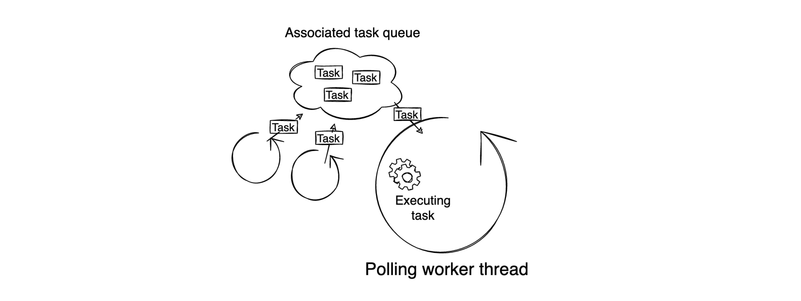
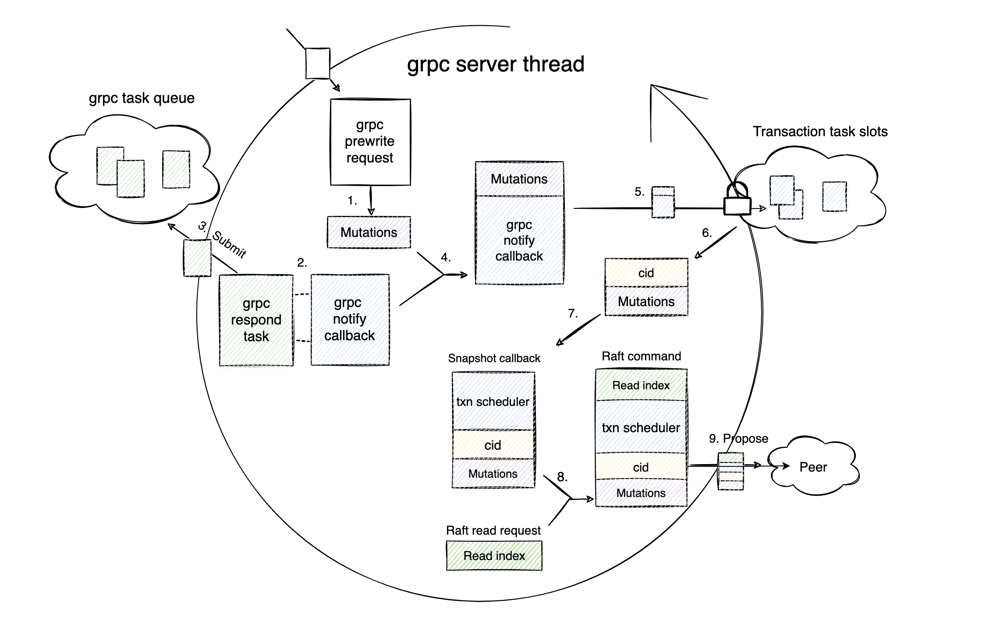
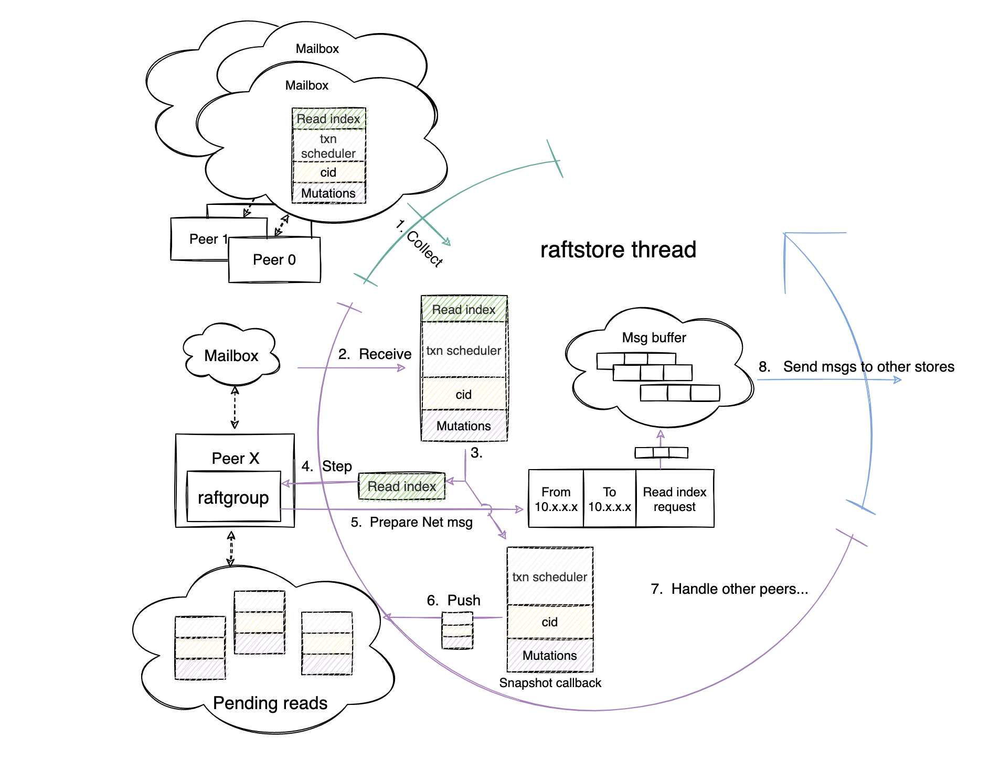
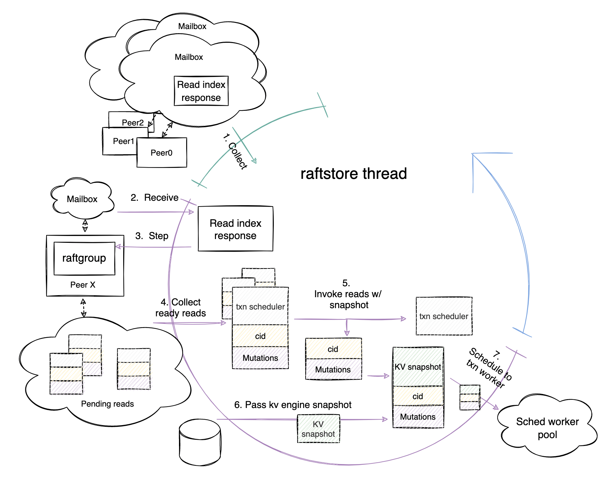
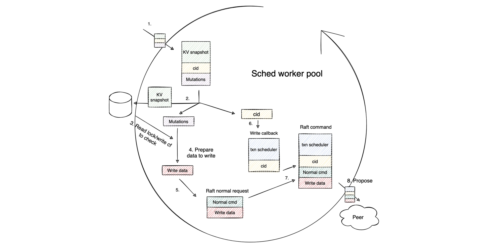
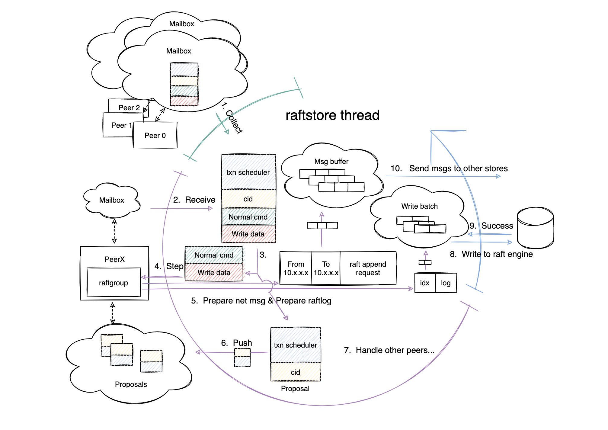
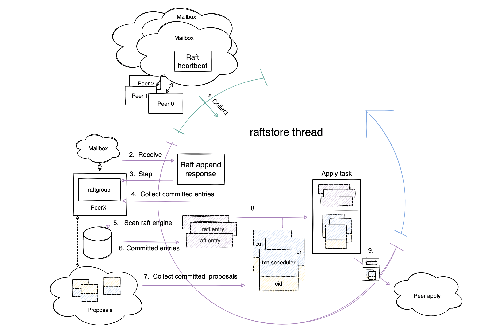
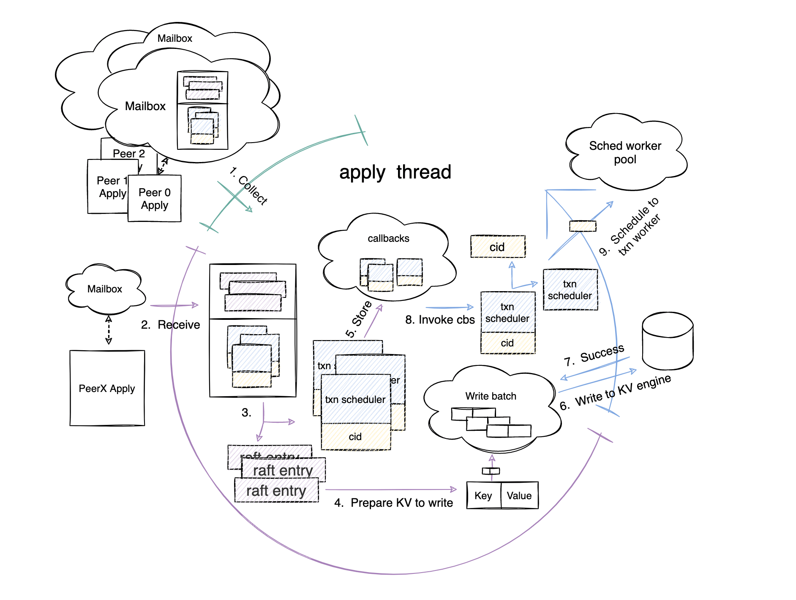
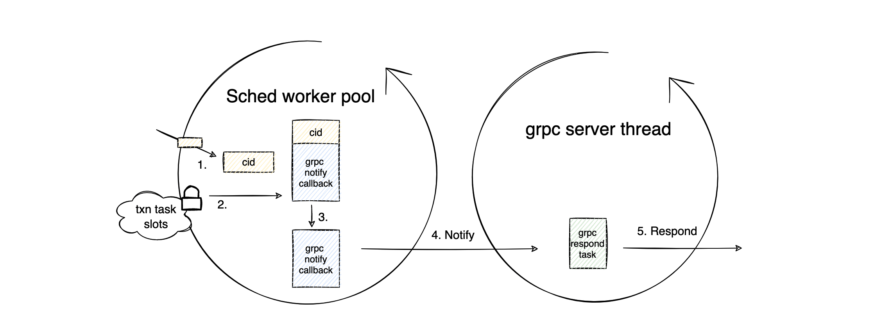

**Author:** [Zhenchi Zhong](https://github.com/zhongzc) (Software Engineer Intern at PingCAP)

**Transcreator:** [Charlotte Liu](https://github.com/CharLotteiu); **Editor:** Tom Dewan

[TiKV](https://tikv.org/) is a distributed key-value storage engine, which is based on the designs of Google Spanner, F1, and HBase. However, TiKV is much simpler to manage because it does not depend on a distributed file system.

As introduced in [A Deep Dive into TiKV](https://pingcap.com/blog/2016-11-09-Deep-Dive-into-TiKV#transaction) and [How TiKV Reads and Writes](https://pingcap.com/blog/how-tikv-reads-and-writes#percolator), TiKV applies a 2-phase commit (2PC) algorithm inspired by [Google Percolator](http://static.googleusercontent.com/media/research.google.com/zh-CN//pubs/archive/36726.pdf) to support distributed transactions. These two phases are `Prewrite` and `Commit`.

In this article, I'll explore the execution workflow of a TiKV request in the prewrite phase, and give a top-down description of how the prewrite request of an [optimistic transaction](https://docs.pingcap.com/tidb/stable/optimistic-transaction) is executed within the multiple modules of the [Region](https://docs.pingcap.com/tidb/stable/glossary#regionpeerraft-group) leader. This information will help you clarify the resource usage of TiKV requests and learn about the related source code in TiKV.

## Work model

When TiKV is initialized, it creates different types of worker threads based on its configuration. Once these worker threads are created, they continuously fetch and execute tasks in a loop. These worker threads are generally paired with associated task queues. Therefore, by submitting various tasks to different task queues, you can execute some processes asynchronously. The following diagram provides a simple illustration of this work model:

 Work model of TiKV worker threads 

## The gRPC Request phase

A TiKV prewrite request begins with a gRPC prewrite request from the network appearing on the gRPC server thread. The following figure shows the workflow in this phase.

 gRPC server thread workflow 

It may not be easy to understand just by looking at the figure, so below I will describe exactly what the gRPC thread does step by step. The number of each step links to the corresponding source code:

* Step [1](https://github.com/tikv/tikv/blob/6708ce171792df02e1e90e1fe1e67e424d1586c8/src/server/service/kv.rs#L1791): Transforms the Prewrite protobuf message into [Mutations](https://github.com/tikv/tikv/blob/5024ad08fc7101ba25f17c46b0264cd27d733bb1/src/storage/mod.rs#L70) that can be understood in the transaction layer. Mutation represents the write operation of a key.
* Step [2](https://github.com/tikv/tikv/blob/6708ce171792df02e1e90e1fe1e67e424d1586c8/src/server/service/kv.rs#L1790): Creates a channel and uses the channel sender to construct a gRPC Notify Callback.
* Step [3](https://github.com/tikv/tikv/blob/6708ce171792df02e1e90e1fe1e67e424d1586c8/src/server/service/kv.rs#L150): Constructs the channel receiver as a gRPC respond task and submits it to the gRPC task queue to wait for notification.
* Step [4](https://github.com/tikv/tikv/blob/6708ce171792df02e1e90e1fe1e67e424d1586c8/src/storage/txn/scheduler.rs#L329): Combines the gRPC notify callback and Mutations as a transaction task.
* Step [5](https://github.com/tikv/tikv/blob/6708ce171792df02e1e90e1fe1e67e424d1586c8/src/storage/txn/scheduler.rs#L330): Gets latches for the Transaction layer and stores the gRPC notify callback in the transaction task slots.
* Step [6](https://github.com/tikv/tikv/blob/6708ce171792df02e1e90e1fe1e67e424d1586c8/src/storage/txn/scheduler.rs#L333-L335): Once the transaction layer successfully obtains the latches, the gRPC server thread continues executing the task with a unique `cid` that can be used to index the gRPC notify callback. The `cid` is globally unique throughout the execution process of the prewrite request.
* Step [7](https://github.com/tikv/tikv/blob/6708ce171792df02e1e90e1fe1e67e424d1586c8/src/storage/txn/scheduler.rs#L366-L404): Constructs the snapshot callback for the Raft layer. This callback consists of the `cid`, Mutations, and the transaction scheduler.
* Step 8: [Creates](https://github.com/tikv/tikv/blob/6708ce171792df02e1e90e1fe1e67e424d1586c8/src/server/raftkv.rs#L421-L427) a Raft Read Index request and [combines](https://github.com/tikv/tikv/blob/6708ce171792df02e1e90e1fe1e67e424d1586c8/components/raftstore/src/store/worker/read.rs#L538) the request with the snapshot callback to form a Raft command.
* Step [9](https://github.com/tikv/tikv/blob/6708ce171792df02e1e90e1fe1e67e424d1586c8/components/raftstore/src/store/worker/read.rs#L377): Sends the Raft command to the peer it belongs to.

The gRPC thread has completed its mission. The rest of the story will continue in the raftstore thread.

## The Read Propose phase

Before I introduce this phase, I'd like to talk about the [batch system](https://github.com/tikv/tikv/blob/6708ce1717/components/batch-system/Cargo.toml). It is the cornerstone of TiKV's multi-raft implementation.

In TiKV, **the raftstore thread** and **the apply thread** are instances of the batch system. These two worker threads also operate in a fixed loop pattern, which is in line with the work model mentioned above.

The raftstore thread and the apply thread go through three phases in a loop: the collect messages phase, the handle messages phase, and the process I/O phase. The following sections describe these phases in detail.

 Batch system work pattern 

Now, let's come back to the story.

When the Raft command is sent to the peer it belongs to, the command is stored in the peer's mailbox. In the collect message phase (the green part of the circle above), the raftstore thread collects several peers with messages in their mailboxes and processes them together in the handle messages phase (the purple part of the circle).

 Read Propose phase workflow 

In this prewrite request example, the Raft command with the Raft Read Index request is stored in the peer's mailbox. After a raftstore thread collects the peer at step [1](https://github.com/tikv/tikv/blob/6708ce171792df02e1e90e1fe1e67e424d1586c8/components/batch-system/src/batch.rs#L278), the raftstore thread enters the handle messages phase.

The following are the corresponding steps that the raftstore thread performs in the handle message phase:

* Step [2](https://github.com/tikv/tikv/blob/6708ce171792df02e1e90e1fe1e67e424d1586c8/components/raftstore/src/store/fsm/store.rs#L802-L827): Reads the Raft command out of the peer's mailbox.
* Step [3](https://github.com/tikv/tikv/blob/6708ce171792df02e1e90e1fe1e67e424d1586c8/components/raftstore/src/store/fsm/peer.rs#L508): Splits the Raft command into a Raft Read Index request and a snapshot callback.
* Step [4](https://github.com/tikv/tikv/blob/6708ce171792df02e1e90e1fe1e67e424d1586c8/components/raftstore/src/store/peer.rs#L2716-L2721): Hands over the Raft Read Index request to the raft-rs library to be processed by the `step` function.
* Step [5](https://github.com/tikv/raft-rs/blob/91a60ce417d55d4ca4d96b29963e3e3fa7f7d8d7/src/raft.rs#L1907-L1942): The raft-rs library prepares the network messages to be sent and saves it in the message buffer.
* Step [6](https://github.com/tikv/tikv/blob/6708ce171792df02e1e90e1fe1e67e424d1586c8/components/raftstore/src/store/peer.rs#L2737): Stores the snapshot callback in the peer's pending reads queue.
* Step [7](https://github.com/tikv/tikv/blob/6708ce171792df02e1e90e1fe1e67e424d1586c8/components/batch-system/src/batch.rs#L295-L314): Returns to the beginning of this phase and processes other peers with the same workflow.

After the raftstore thread processes all the peers' messages, it comes to the last phase of a single loop: the process I/O phase (the blue part of the circle). In this phase, the raftstore thread sends network messages stored in the message buffer to the other TiKV nodes of the cluster via the network interface at step [8](https://github.com/tikv/tikv/blob/6708ce171792df02e1e90e1fe1e67e424d1586c8/src/server/raft_client.rs#L910-L932).

This concludes the Read Propose phase. Before the prewrite request can make progress, it must wait for other TiKV nodes to respond.

## The Read Apply phase

After a "long" wait (a few milliseconds are actually long for a computer), the TiKV node that sends the network message finally receives responses from other follower nodes, and saves the reply messages in the peer's mailbox. Now the prewrite request enters the Read Apply phase. The following figure shows the workflow in this phase:

 Read Apply phase workflow 

The hardworking raftstore thread notices that there is a message waiting to be processed in this peer's mailbox, so the thread's behavior in this phase is as follows:

* Step [1](https://github.com/tikv/tikv/blob/6708ce171792df02e1e90e1fe1e67e424d1586c8/components/batch-system/src/batch.rs#L278): Collects the peer again when it loops back to the collect messages phase.
* Step [2](https://github.com/tikv/tikv/blob/6708ce171792df02e1e90e1fe1e67e424d1586c8/components/raftstore/src/store/fsm/store.rs#L802-L827): Same as that in the previous phase, the thread reads the reply message out of the peer's mailbox.
* Step [3](https://github.com/tikv/tikv/blob/6708ce171792df02e1e90e1fe1e67e424d1586c8/components/raftstore/src/store/fsm/peer.rs#L1230): Passes the message to the raft-rs to be processed by the `step` function.
* Step [4](https://github.com/tikv/tikv/blob/6708ce171792df02e1e90e1fe1e67e424d1586c8/components/raftstore/src/store/peer.rs#L2078-L2080): Identifies which read operations can be applied after the message is processed and collects the operations.
* Step [5](https://github.com/tikv/tikv/blob/6708ce171792df02e1e90e1fe1e67e424d1586c8/components/raftstore/src/store/peer.rs#L1975): Invokes the snapshot callbacks which are temporarily stored in the peer's pending reads queue.
* Step [6](https://github.com/tikv/tikv/blob/6708ce171792df02e1e90e1fe1e67e424d1586c8/components/raftstore/src/store/worker/read.rs#L105-L110): Constructs and sends the snapshot of the KV engine to the snapshot callbacks.
* Step [7](https://github.com/tikv/tikv/blob/6708ce171792df02e1e90e1fe1e67e424d1586c8/src/storage/txn/scheduler.rs#L559-L594): Splits the snapshot callbacks into transaction schedulers and tasks consisting of snapshot, `cid`, and Mutations. Then, the raftstore thread sends the tasks to the transaction worker threads according to the information recorded by the transaction scheduler.

This concludes the Read Apply phase. Next, it's the transaction worker's turn.

## The Write Prepare phase

In this phase, when a transaction worker in the schedule worker pool receives the task sent by the raftstore thread at step [1](https://github.com/tikv/yatp/blob/6bbea16a485583d7a6e32de335f6c6ec448df44a/src/pool/worker.rs#L44), the worker starts processing the task at step [2](https://github.com/tikv/yatp/blob/6bbea16a485583d7a6e32de335f6c6ec448df44a/src/task/future.rs#L261) by splitting the task into the KV snapshot, the Mutations, and the `cid`.

 Write Prepare phase workflow 

The main logic of the transaction layer now comes into play. It includes the following steps performed by the transaction worker thread:

* Step [3](https://github.com/tikv/tikv/blob/6708ce171792df02e1e90e1fe1e67e424d1586c8/src/storage/txn/actions/prewrite.rs#L45-L86): Reads the KV engine via the snapshot and checks whether the transaction constraints hold.
* Step [4](https://github.com/tikv/tikv/blob/6708ce171792df02e1e90e1fe1e67e424d1586c8/src/storage/txn/actions/prewrite.rs#L88): Prepares the data to be written for the prewrite request after the check is passed.
* Step [5](https://github.com/tikv/tikv/blob/6708ce171792df02e1e90e1fe1e67e424d1586c8/src/server/raftkv.rs#L261-L263): Wraps the data into a normal Raft request.
* Step [6](https://github.com/tikv/tikv/blob/6708ce171792df02e1e90e1fe1e67e424d1586c8/src/storage/txn/scheduler.rs#L726-L745): Prepares a new write callback with the `cid`.
* Step [7](https://github.com/tikv/tikv/blob/6708ce171792df02e1e90e1fe1e67e424d1586c8/components/raftstore/src/router.rs#L50-L55): Assembles the callback with the normal Raft request into a Raft command.
* Step [8](https://github.com/tikv/tikv/blob/6708ce171792df02e1e90e1fe1e67e424d1586c8/components/raftstore/src/router.rs#L53): Proposes the command to the peer it belongs to.

The transaction layer logic ends here. This Raft command contains write operations. If the command runs successfully, the prewrite request is successful.

## The Write Propose phase

Now it's time for the raftstore thread to propose the write operations. The following figure shows how the raftstore thread processes the Raft command in this phase.

 Write Propose phase workflow 

The first three steps in this phase are the same as those in the previous sections. I won't repeat them here. Let's go through the remaining steps:

* Step [4](https://github.com/tikv/raft-rs/blob/91a60ce417d55d4ca4d96b29963e3e3fa7f7d8d7/src/raw_node.rs#L324-L333): raft-rs saves the net message to the message buffer.
* Step [5](https://github.com/tikv/raft-rs/blob/91a60ce417d55d4ca4d96b29963e3e3fa7f7d8d7/src/raft.rs#L1895-L1904): raft-rs appends the Raft log to the write batch.
* Step [6](https://github.com/tikv/tikv/blob/6708ce171792df02e1e90e1fe1e67e424d1586c8/components/raftstore/src/store/peer.rs#L2307-L2320): The peer transfers the write callback to a proposal and stores it in the peer's internal proposal queue.
* Step [7](https://github.com/tikv/tikv/blob/6708ce171792df02e1e90e1fe1e67e424d1586c8/components/batch-system/src/batch.rs#L295-L314): The raftstore thread goes back to process other peers with messages in their mailboxes.
* Step [8](https://github.com/tikv/tikv/blob/6708ce171792df02e1e90e1fe1e67e424d1586c8/components/raftstore/src/store/fsm/store.rs#L648-L666): The raftstore thread comes to the process I/O phase (blue part of the circle) and writes the messages temporarily stored in the write batch to the Raft engine.
* Step 9: The Raft engine returns that the messages are successfully written.
* Step [10](https://github.com/tikv/tikv/blob/6708ce171792df02e1e90e1fe1e67e424d1586c8/src/server/raft_client.rs#L910-L932): The raftstore thread sends the net messages to other storage nodes.

The Write Propose phase is over. Now, as with the end of the Read Propose phase, the leader node must wait for responses from other TiKV nodes before it moves on to the next phase.

## The Write Commit phase

After another "long" wait, follower nodes respond to the Leader node and bring the prewrite request to the Write Commit phase.

 Write Commit phase workflow 

* Step [2](https://github.com/tikv/tikv/blob/6708ce171792df02e1e90e1fe1e67e424d1586c8/components/raftstore/src/store/fsm/store.rs#L802-L827): The peer receives Raft append responses from other TiKV nodes.
* Step [3](https://github.com/tikv/raft-rs/blob/91a60ce417d55d4ca4d96b29963e3e3fa7f7d8d7/src/raft.rs#L1534-L1626): The step function processes the response messages.
* Steps [4](https://github.com/tikv/tikv/blob/6708ce171792df02e1e90e1fe1e67e424d1586c8/components/raftstore/src/store/peer_storage.rs#L749-L799), [5](https://github.com/tikv/tikv/blob/6708ce171792df02e1e90e1fe1e67e424d1586c8/components/raftstore/src/store/peer_storage.rs#L749-L799), and [6](https://github.com/tikv/tikv/blob/6708ce171792df02e1e90e1fe1e67e424d1586c8/components/raftstore/src/store/peer_storage.rs#L749-L799): The raftstore thread collects committed Raft entries from the Raft Engine.
* Step [7](https://github.com/tikv/tikv/blob/6708ce171792df02e1e90e1fe1e67e424d1586c8/components/raftstore/src/store/peer.rs#L1858-L1879): The raftstore thread collects the proposals associated with the committed Raft entries from the internal proposal queue.
* Step [8](https://github.com/tikv/tikv/blob/6708ce171792df02e1e90e1fe1e67e424d1586c8/components/raftstore/src/store/peer.rs#L1880-L1886): The raftstore thread assembles Raft-committed entries and associated proposals into an apply task.
* Step [9](https://github.com/tikv/tikv/blob/6708ce171792df02e1e90e1fe1e67e424d1586c8/components/raftstore/src/store/peer.rs#L1887-L1888): The raftstore thread sends the task to the apply thread.

With the Write Commit phase coming to an end, the raftstore thread completes all its tasks. Next, the baton is handed over to the apply thread.

## The Write Apply phase

This is the most critical phase for a prewrite request, in which the thread actually writes to the KV engine.

 Write Apply phase workflow 

After the apply thread receives the apply task sent by the raftstore thread at steps 1 and 2, it continues with the following steps in the handle messages phase (the purple part of the circle):

* Step [3](https://github.com/tikv/tikv/blob/6708ce171792df02e1e90e1fe1e67e424d1586c8/components/raftstore/src/store/fsm/apply.rs#L3067): Reads the committed Raft entries from the tasks.
* Step [4](https://github.com/tikv/tikv/blob/6708ce171792df02e1e90e1fe1e67e424d1586c8/components/raftstore/src/store/fsm/apply.rs#L1310-L1344): Transfers the entries into key-value pairs and stores the key-value pairs into the write batch.
* Step [5](https://github.com/tikv/tikv/blob/6708ce171792df02e1e90e1fe1e67e424d1586c8/components/raftstore/src/store/fsm/apply.rs#L1086): Reads the proposals from the tasks and stores them as callbacks.

Then, in the next phase (process I/O), the apply thread takes the following steps:

* Step [6](https://github.com/tikv/tikv/blob/6708ce171792df02e1e90e1fe1e67e424d1586c8/components/raftstore/src/store/fsm/apply.rs#L464-L483): Writes the key-value pairs in the write batch to the KV engine.
* Step 7: Receives the result that the KV engine returns about whether the write operation is successful.
* Step [8](https://github.com/tikv/tikv/blob/6708ce171792df02e1e90e1fe1e67e424d1586c8/components/raftstore/src/store/fsm/apply.rs#L495-L497): Invokes all callbacks.

When a callback is invoked, the transaction scheduler sends the task with the `cid` to the transaction worker at step [9](https://github.com/tikv/tikv/blob/6708ce171792df02e1e90e1fe1e67e424d1586c8/src/storage/txn/scheduler.rs#L727-L744), bringing us to the final part of the story.

## The Return phase

This is the final phase of the prewrite process. TiKV returns the execution result of the prewrite request to the client.

 Return phase workflow 

The workflow in this phase is mainly performed by the transaction worker:

* Step [1](https://github.com/tikv/tikv/blob/6708ce171792df02e1e90e1fe1e67e424d1586c8/src/storage/txn/scheduler.rs#L731-L739): The transaction worker gets the `cid` sent by the transaction scheduler.
* Step [2](https://github.com/tikv/tikv/blob/6708ce171792df02e1e90e1fe1e67e424d1586c8/src/storage/txn/scheduler.rs#L493): The transaction worker accesses the transaction task slots with mutual exclusion using the `cid`.
* Step [3](https://github.com/tikv/tikv/blob/6708ce171792df02e1e90e1fe1e67e424d1586c8/src/storage/txn/scheduler.rs#L498): The transaction worker fetches the gRPC notify callback which is stored in the transaction task slots during the gRPC Request phase.
* Step [4](https://github.com/tikv/tikv/blob/6708ce171792df02e1e90e1fe1e67e424d1586c8/src/storage/txn/scheduler.rs#L509): The transaction worker sends a notification to the gRPC Respond task waiting in the gRPC task queue.
* Step 5: The gRPC server thread responds to the client with the success results.

## Conclusion

This article introduces the eight phases of a successful prewrite request and focuses on the workflow within each phase. I hope this post can help you clarify the resource usage of TiKV requests and give you a deeper understanding of TiKV.

For more TiKV implementation details, see the [TiKV documentation](https://tikv.org/docs/3.0/concepts/overview/) and [deep dive](https://tikv.org/deep-dive/introduction/). If you have any questions or ideas, feel free to join the [TiKV Transaction SIG](https://developer.tidb.io/sig/transaction) and share them with us!
